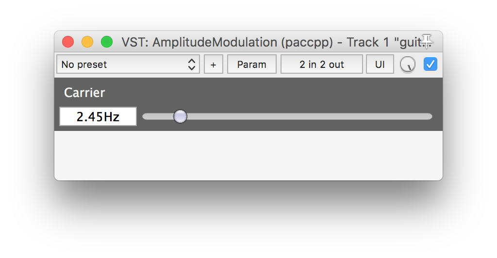
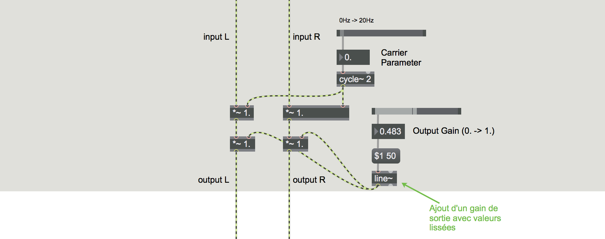
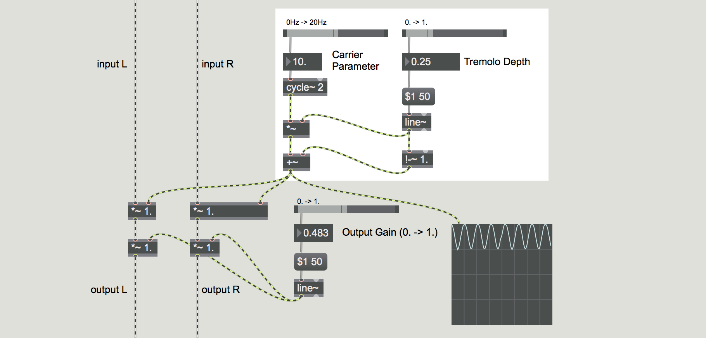
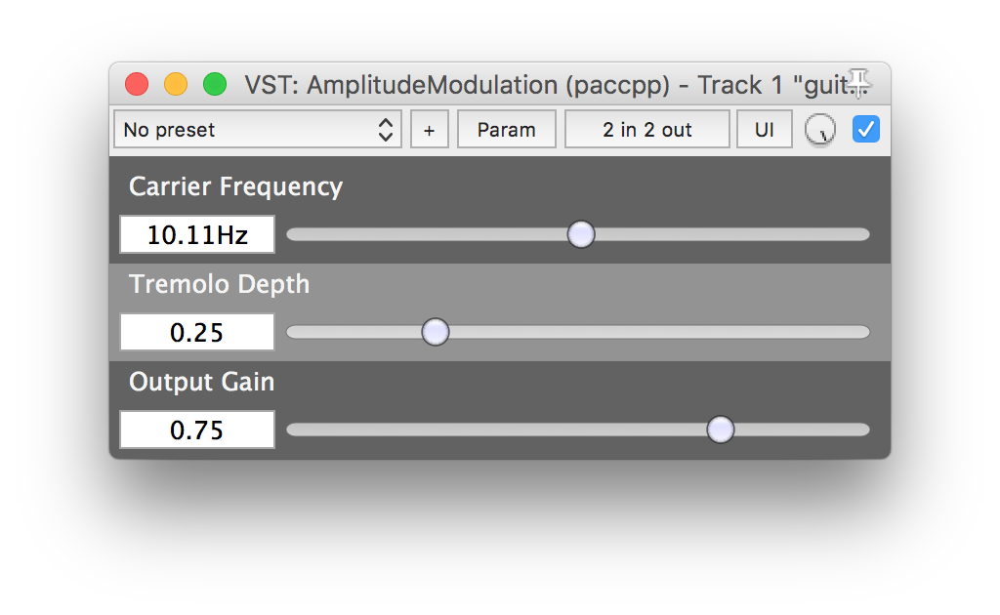

# Séance 10

<p><sup><a href="../s09">précédente</a> | <a href="../s11">suivante</a></sup></p>

## Découverte du *framework* [Juce](https://www.juce.com/) (02)

La semaine dernière nous avons implémenté un traitement tout simple sous la forme d'un plugin VST avec Juce.  
Ce plugin ([disponible ici](https://github.com/paccpp/JucePlugins/tree/master/AmplitudeModulation)) est un simple plugin à base de LFO qui fait pour l'instant une modulation en anneau dont la fréquence peut être variée grâce à un [Slider](https://www.juce.com/doc/classSlider).  

### Exercice :

Je vous propose comme exercice de modifier ce plugin en ajoutant d'autres paramètres manipulables graphiquement.

#### Etape 1 - compilation

Dans un premier temps, téléchargez le code initial du plugin et compilez-le en suivant les instructions fournies dans le fichier [readme.md](https://github.com/paccpp/JucePlugins) du répertoire JucePlugins.  

Vous devriez obtenir une fenêtre comme celle-ci une fois le plugin chargé au sein d'un logiciel hôte (ici [Reaper](http://www.reaper.fm/)) :



#### Etape 2 - Ajout d'un paramètre de gain de sortie

Si on prototype le traitement DSP du plugin dans *Max*, à l'heure actuel cela donne:


Ajoutez un paramètre au plugin pour gérer un gain de sortie général pouvant varier entre `0.` et `1.` pour produire l'effet suivant :



Dans un premier temps vous pouvez simplement ajouter un paramètre en vous inspirant du paramètre de fréquence déjà implémenté. Néanmoins vous verrez très vite que ça génère des clics au changement de la valeur. Pour remédier à ça, on doit *lisser* la valeur. Dans Juce on peut se servir de la classe [LinearSmoothedValue<ValueType>](https://www.juce.com/doc/classLinearSmoothedValue) prévue à cet effet.

Le paramètre de gain se présentera alors non-plus sous la forme d'un simple `float` mais sera de type `juce::LinearSmoothedValue<float> m_gain;`

Quand vous voudrez changer la valeur de gain il vous suffira alors d'écrire :

```cpp
float new_gain_value = 0.6f;
m_gain.setValue(new_gain_value);
```

Pour chaque nouveau sample, dans la méthode `processBlock` du `PluginProcessor` vous pouvez demander la valeur de gain lissée en écrivant :

```cpp
void AmplitudeModulationAudioProcessor::processBlock (AudioSampleBuffer& buffer, MidiBuffer& midiMessages)
{
    // [...]

    for(int i = 0; i < buffer.getNumSamples(); ++i)
    {
        float gain = m_gain.getNextValue();

        // [...]
    }
}
```

#### Etape 3 - Ajout d'un paramètre de profondeur de tremolo

Vous ajouterez un troisième paramètre qui permette de gérer la profondeur du tremolo comme présenté au sein du patch suivant :



Version finale du plugin :



---

#### Quelques liens pour vous aider :

- [Tutoriels](https://www.juce.com/tutorials)
- [API](https://www.juce.com/doc/classes)
- [Forum](https://forum.juce.com/)
